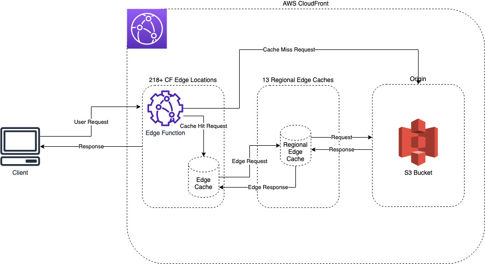

# cko-devops-exercise

This repository contains a module that creates an S3 bucket to serve static content out to the public. 
It makes use of AWS Route53, AWS ACM, CloudFront, CloudFront Functions, S3, SNS (for alerting),
KMS with CMKs for encryption wherever possible. It makes uses of CloudFront Functions to serve
static content at the edge closest to the requesting user. According to AWS, this is scalable to millions of requests per second.

## How it works

Users can make calls to the https endpoint, which will then route requests to the CloudFront distribution. This will identify the users location
and the nearest AWS CloudFront PoP servers to said user, if the content is not cached, it will send a request to the origin (S3) using a CloudFront Function,
if the content is cached, it will serve it from the edge location. 

## Usage

Please see `iac/main.tf` for an example of how to call the module. You will need to provide the required variables found in the modules README.md (in `iac/modules/static-website-s3-cloudfront`)

You can run this in a standard way using Terraform. The email address variable is used for notifications via SNS.

Once applied you should have the bucket ready for the files to be uploaded. The asssets are in the `website-assets`
directory, and I have not provided a mechanism for uploading / managing the website content. If I were to I would use GitHub Actions to create a very small type of CD system to deliver updated assets to the bucket.

## Diagram

